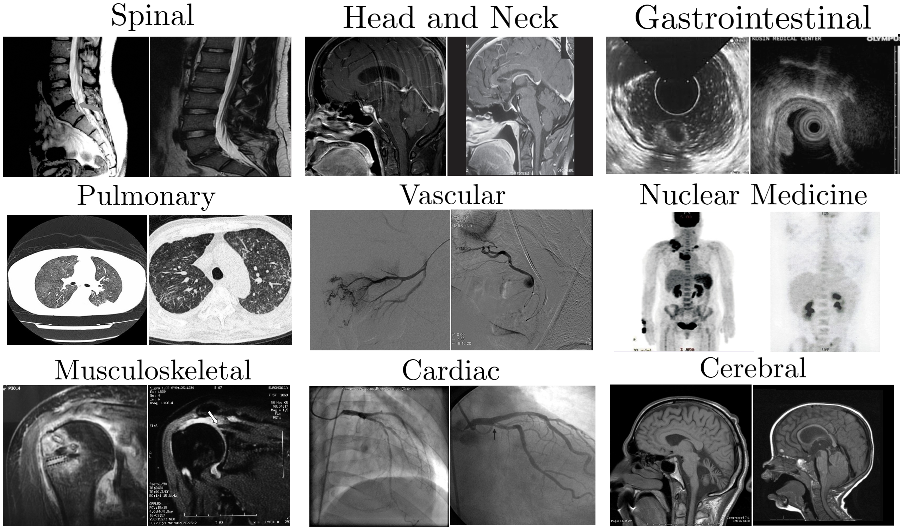
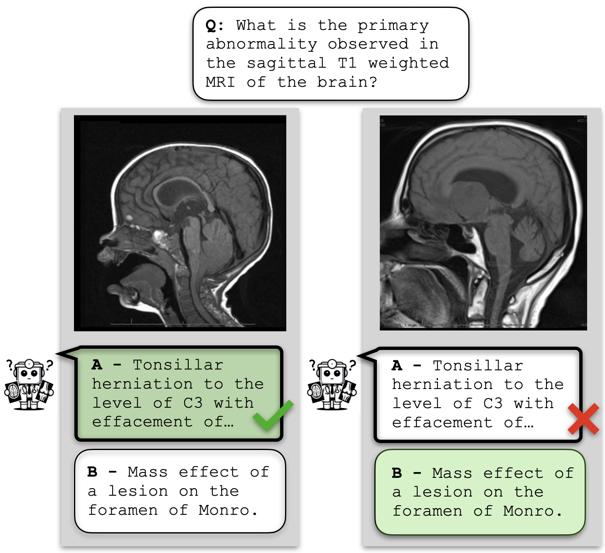

<p align="center">
  
</p>

<h1 align="center">Can you trust your AI radiologist?<br />Probing the reliability of <br />multimodal medical foundation models</h1>
<h3 align="center">Mohammad Shahab Sepehri, Zalan Fabian, Maryam Soltanolkotabi, Mahdi Soltanolkotabi</h3>
<!-- 
Probing the reliability of multimodal medical foundation models
## Can you trust your AI radiologist? <br /> Probing the reliability of multimodal medical foundation models
#### Mohammad Shahab Sepehri, Zalan Fabian, Maryam Soltanolkotabi, Mahdi Soltanolkotabi
<!-- 
> [**MediConfusion: Can you trust your AI radiologist? Probing the reliability of multimodal medical foundation models**](-),  
> Mohammad Shahab Sepehri, Zalan Fabian, Maryam Soltanolkotabi, Mahdi Soltanolkotabi
-->
<p align="center">
| 🤗 <a href="https://huggingface.co/datasets/shahab7899/MediConfusion">Hugging Face</a> | 📄
 <a href="https://arxiv.org/abs/2409.15477">Paper</a> | 🌐
 <a href="https://sites.usc.edu/aif4s/?p=2200">Blog</a> | 
</p> 

[](https://opensource.org/license/MIT)

<p align="justify" > 
MediConfusion is a challenging medical Visual Question Answering (VQA) benchmark dataset, that probes the failure modes of medical Multimodal Large Language Models (MLLMs) from a vision perspective. We reveal that state-of-the-art models are easily confused by image pairs that are otherwise visually dissimilar and clearly distinct for medical experts. These are some examples of confusing image pairs from the ROCO radiology dataset:
</p>
<p align="center">
  
</p>
<p align="justify"> 
Our benchmark consists of 176 confusing pairs. A confusing pair is a set of two images that share the same question and corresponding answer options, but the correct answer is different for the images. <br />
</p>
<p align="center">
  
</p>
<p align="justify"> 
We evaluate models based on their ability to answer <i>both</i> questions correctly within a confusing pair, which we call <b>set accuracy</b>. This metric indicates how well models can tell the two images apart, as a model that selects the same answer option for both images for all pairs will receive 0% set accuracy. We also report <b>confusion</b>, a metric that describes the proportion of confusing pairs where the model has chosen the same answer option for both images.
</p>
<p align="justify"> 
 Strikingly, all available models (open-source or proprietary) achieve performance below random guessing on MediConfusion, raising serious concerns about the reliability of existing medical MLLMs for healthcare deployment.
</p>

## 📊 Leaderboard
<div align="center">


| Rank | Model | Version | Set acc. (%) | Confusion (%) |
| :--: | :--: | :--: | :--: |  :--: |
| 🏅️ | **Random Guessing** | - | **25.00** | 50.00 |
| 🥈 | **[Gemini](https://deepmind.google/technologies/gemini/pro/)** | 1.5 Pro | 19.89 | 58.52 |
| 🥉 | **[GPT](https://openai.com/index/hello-gpt-4o/)** | 4o (release 20240513) | 18.75 | 75.00 |
| 4 | [Llama 3.2](https://www.llama.com/) | 90B-Vision-Instruct | 15.34 | 78.41 |
| 5 | [InstructBLIP](https://github.com/salesforce/LAVIS/tree/main/projects/instructblip) | Vicuna 7B | 12.50 | 80.35 | 
| 6 | [Molmo](https://molmo.allenai.org/) | 7B-D-0924 | 9.66 | 86.21 |
| 7 | [LLaVA](https://huggingface.co/llava-hf/llava-v1.6-mistral-7b-hf) | v1.6-Mistral 7B | 9.09 | 85.80 |
| 8 | [Claude](https://claude.ai/new) | 3 Opus | 8.52 | 84.09 |
| 9 | [BLIP-2](https://github.com/salesforce/LAVIS/tree/main/projects/blip2) | Opt 2.7B | 6.82 | 86.93 |
| 10 | [Molmo](https://molmo.allenai.org/) | 72B-0924 | 6.82 | 85.80 |
| 11 | [RadFM](https://github.com/chaoyi-wu/RadFM) | - | 5.68 | 85.80 |
| 12 | [Med-Flamingo](https://github.com/snap-stanford/med-flamingo) | - | 4.55 | 98.30 |
| 13 | [LLaVA-Med](https://github.com/microsoft/LLaVA-Med) | v1.5-Mistral 7B | 1.14 | 97.16 |

</div>

## Updates

- [2024/09/11] _Molmo_ family added to the supported models.
- [2024/03/11] _Llama 3.2_ family added to the supported models.

## 📖 Table of Contents

  * [Requirements](#-requirements)
    * [Data Download](#data-download)
    * [Open-source Models](#open-source-models)
    * [Proprietary Models](#proprietary-models)
    * [Package Versions](#package-versions)
  * [Usage](#-usage)
    * [Evaluation](#evaluation)
    * [Arguments](#arguments)

## 🔧 Requirements

Create and activate a `conda` environment with the following command:
```
conda create -n "mediconfusion" python=3.10
conda activate mediconfusion
```

Use the following code to install requirements:

```
pip install -r requirements.txt
```

<!-- To evaluate `LLaVA-Med`, follow the instructions [here](https://github.com/microsoft/LLaVA-Med/tree/main) and install `LLaVA-Med`. -->

If you have any problem using the models, please follow the instructions below.

### Data Download
<p align="justify" > 
The images in MediConfusion have to be downloaded directly from the source due to their license.
To download all images (26 MB), use the following command:

</p>

```
python scripts/download.py
```

The images can also be downloaded directly from [ROCO](https://github.com/razorx89/roco-dataset) (set `local_image_address` to `False`). In this case, set `data_path` to the download folder when running the evaluation script (more details in [Usage](#-usage)). <br />

### Open-source Models
* `LLaVA-Med`: Follow the instructions [here](https://github.com/microsoft/LLaVA-Med/tree/main) and install `LLaVA-Med`. Download the model from [here](https://huggingface.co/microsoft/llava-med-7b-delta) and set `model_path` in the [config](./configs/Models/llava_med/vanilla.json) to its folder.
* `LLaMA 3.2`: To download this model you should get access by requesting in [here](https://huggingface.co/meta-llama/Llama-3.2-11B-Vision). Then, add your token to the [config](./configs/Models/llama/vanilla.json). If you encountered CUDA memory error, set `device` to `auto`.
* `Molmo`: If you encountered CUDA memory error, set `device` to `auto`.
* `LLaMA`: Download the model from [here](https://huggingface.co/yahma/llama-7b-hf) and set `LLaMa_PATH` in the `MedFlamingo` [config](./configs/Models/med_flamingo/vanilla.json) to its folder.
* `MedFlamingo`: Download the model from [here](https://huggingface.co/med-flamingo/med-flamingo) and set `CHECKPOINT_PATH` in the [config](./configs/Models/llava_med/vanilla.json) to its folder. 
* `RadFM`: Download the model from [here](https://huggingface.co/chaoyi-wu/RadFM) and set `model_path` in the [config](./configs/Models/radfm/vanilla.json) to its folder.

### Proprietary Models
To use proprietary models, save your API keys in the root directory of the repo in a file named `.env,` including the keys as in the example below.
```
GEMINI_API_KEY=YOUR_KEY
AZURE_OPENAI_API_KEY=YOUR_KEY
AZURE_OPENAI_ENDPOINT=YOUR_KEY
ANTHROPIC_API_KEY=YOUR_KEY
```

### Package Versions
Different MLLMs need different versions of the `transformers` package. Please use the following versions for each MLLM.<br />
* `LLaVA-Med`: Use `transformers==4.36.2`
* `RadFM`: Use `transformers==4.28.1`
* `MedFlamingo`: Use `transformers==4.44.2` and install `open-flamingo` package
* `Gemini`: You need `python>=3.9`
* `Other MLLMs`: Use `transformers==4.44.2` and `python>=3.8`

## 🔰 Usage

### Evaluation
Before using the code, make sure to follow the instructions in [Requirements](#-requirements). <br />
You can create/change model configurations in `configs/MODEL_NAME/`.<br />
To use the evaluation code, use the following command:
```
python scripts/answering.py --mllm_name MODEL_NAME --mode MODE
```
The results will be saved in `Results/MODEL_NAME/`. You will see two files: one containing the final scores and one containing the answers provided by the model.  <br/>
After runing `answering.py` you can print the results again with the command below:
 ```
python scripts/printing.py --mllm_name MODEL_NAME --mode MODE
```
### Arguments
* `mode`: This sets the evaluation method. Available options are `gpt4` (FF), `mc` (MC), `greedy` (GD), and `prefix` (PS). For proprietary models, you can only use the first two methods.
* `mllm_name`: This is the name of your desired MLLM. Available options are `gpt` (GPT-4o), `gemini` (Gemini 1.5 Pro), `claude` (Claude 3 Opus), `llava` (LLaVA), `blip2` (BLIP-2), `intructblip` (InstructBLIP), `llava_med` (LLaVA-Med), `radfm` (RadFM), and `med_flamingo` (Med-Flamingo).
* `model_args_path` (default: `configs/MLLM_NAME/vanilla.json`): Path to the model's configuration file.
* `tr` (default: 3): Threshold used for FF evaluation to select an option. If the difference between assigned scores is at least `tr`, we select the option with the higher score. 
* `resume_path` (default: `None`): If your run is interrupted and you want to resume evaluation, you should set this argument to the path to the answers of the previous run.
* `local_image_address` (default: `True`): If `Flase`, the code looks for the images based on their ROCO IDs. Otherwise, it looks for the images based on their local IDs.
* `data_path` (default: `./data/images`): Path to the images. If you download the images using our script, this is `./data/images`. If you are not using local addressing, this is the path to the [ROCO](https://github.com/razorx89/roco-dataset).
* `device` (default: `cuda`): You can use `cuda` or `cpu`. For `LLaVA-Med`, our code does not support `cpu`.

## 📌 Citation

If you use this code or our dataset, please cite our [paper](https://arxiv.org/abs/2409.15477).

```bibtex
@article{sepehri2024mediconfusion,
  title={MediConfusion: Can You Trust Your AI Radiologist? Probing the reliability of multimodal medical foundation models},
  author={Sepehri, Mohammad Shahab and Fabian, Zalan and Soltanolkotabi, Maryam and Soltanolkotabi, Mahdi},
  journal={arXiv preprint arXiv:2409.15477},
  year={2024}
}
```
